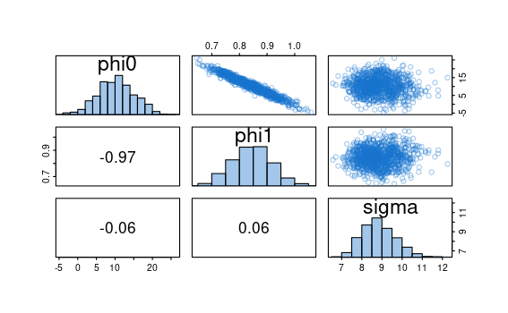
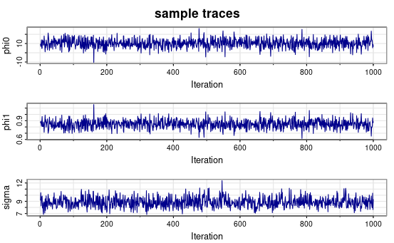
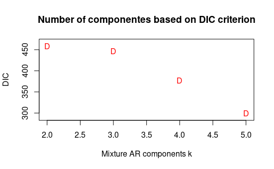
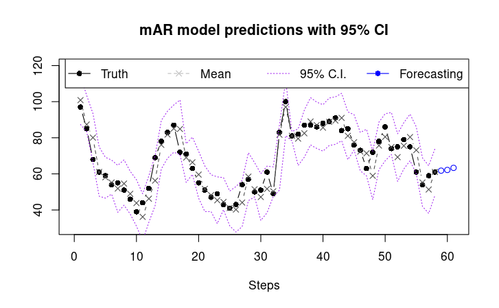

```{r setup, include=FALSE}
knitr::opts_chunk$set(dev = 'pdf')
library(png)
```


**Abstract**. An autorregressive AR(1) model and a mixed autorregressive mAR(1,k=5) have been fitted for time-series data involving weekly Google searches for the term "covid" between the time range 03/2020 - 05/2021. Both models predict that in the last three weeks of May 2021 the number of searches for the term are likely to increase.


**Introduction and data description**. The data employeed is based on the number of weekly Google searches performed between 03/2020-05/2021. It can either be downloaded manually from Google or using the Rpackage Rgtrends. This project aims to practise bayesian modelling applied to AR and mAR models for this time series data, which is depicted below.

**Data exploration**. The ACF plot shows significant correlations between time series in the first 5 lags (so the model we are making will be with those time series). The ACF and PACF plots presents a decay, suggesting the presence of a potential **linear trend** and **seasonality** in the data.


```{r, echo=FALSE, warning=FALSE}
yt = vroom::vroom('GoogleSearchIndex.txt', show_col_types = F)
yt$Week =as.Date(as.character(yt$Week),format = "%Y-%m-%d")
y = yt$covid
```


```{r, echo=FALSE}
y = yt$covid
n.all=length(y)
p.star=15
Y=matrix(y[(p.star+1):n.all],ncol=1)
sample.all=matrix(y,ncol=1)
n=length(Y)
p=seq(1,p.star,by=1)


design.mtx=function(p_cur){
  Fmtx=matrix(0,ncol=n,nrow=p_cur)
  for (i in 1:p_cur) {
    start.y=p.star+1-i
    end.y=start.y+n-1
    Fmtx[i,]=sample.all[start.y:end.y,1]
    }
  return(Fmtx)
}

criteria.ar=function(p_cur){
  Fmtx=design.mtx(p_cur)
  beta.hat=chol2inv(chol(Fmtx%*%t(Fmtx) + 1-20*diag(nrow(Fmtx))        ))%*%Fmtx%*%Y
  R=t(Y-t(Fmtx)%*%beta.hat)%*%(Y-t(Fmtx)%*%beta.hat)
  sp.square=R/(n-p_cur)
  aic=2*p_cur+n*log(sp.square)
  bic=log(n)*p_cur+n*log(sp.square)
  result=c(aic,bic)
  return(result)
}

criteria=sapply(p, criteria.ar)

# Make all plots together

par(mfrow=c(2,2))
plot(yt$Week, yt$covid, main='Google weekly searches for "covid"', xlab='Year', ylab='Hits', type='l')
acf(yt$covid, main="ACF covid data")
pacf(yt$covid, main="PACF covid data")
plot(p,criteria[1,],type='p',pch='AIC',col='red',xlab='AR order p',ylab='Criterion',main='AIC (A) and BIC (B) criterion for AR(p) model', ylim=c(min(criteria)-10,max(criteria)+10))
points(p,criteria[2,],pch='BIC',col='blue')
```


\pagebreak


## AR(p) model

**Order of the model** The Akaike Informative Criterion (AIC) and Bayesian Information Criterion (BIC) were computed for 8 orders (see previous figure). The values have been regularized with a 1e-5 value to elude problems in the Cholesky decomposition (**this can make my plot different to yours!**). Based on the AIC and BIC criterions, the best model is order 1. 


**The hierarchical model equation**. The AR model can be defined through the following equation:

$y_t=\phi_1y_{t-1}+\phi_2y_{t-2}+\epsilon_t,\quad \epsilon_t\sim N(0,1)$


**Assumptions**. The error is normally distributed with constant variance (initial 1). Also assumes a normal inverse gamma model: 
$x_t = \phi_0 + \phi_1 x_{t-1} + … + \phi_p x_{t-p} + \sigma z_t$


**Prior parameters and parameter estimation**. 1000 simulations (Gibbs sampling) were run considering an AR model of order 1 and using flat priors. The next hyperparameters were chosen:

${m}_0=(0,0)^T,{C}_0=I_2,n_0=2,d_0=2$


Based on the sample trace plots the parameter estimation process converged. Their Gaussian posterior distributions  are represented with histogram representations. The posterior means of the parameters and their distributions are also reported:

```{r, echo=FALSE, include=FALSE}
res.ar = astsa::ar.mcmc(xdata = y, porder = 1, plot=F)
```


{width=300}

{width=300}

\pagebreak

**Model predictions and forecasting**. Using the AR(1) model we now perform model predictions and forecast 3 weeks ahead of the results. Let's see how good it does.

```{r, echo=FALSE}
h=3
pars = c(10.35, 0.84, 8.84)
pred.y = round(pars[1]+pars[2]*((length(y)+1):(length(y)+h)), 1)
model.ar = arima(yt$covid, order = c(1,0,0))

# Make predictions 
preds.ar = yt$covid - arima(yt$covid, order = c(1,0,0))$res * 1.05
future_preds.ar = predict(model.ar, n.ahead = h)$pred[1:h]


plot(x=1:nrow(yt), y=yt$covid, type='l', xlab='Steps (Weeks)', ylab='Search hits',
     col='black', main='AR(1) model predictions', xlim=c(0, nrow(yt)+h))
lines(x=1:(nrow(yt)-1), y=preds.ar[-1], type='b',col='gray40',lty=2,pch=4)
lines(x= seq(nrow(yt)+1, (nrow(yt)+h)), y=future_preds.ar, type='b',col='blue',lty=2,pch=4)
legend("topright",legend=c('Truth', 'Predictions','Forecasting'),lty=1,
       col=c('black','gray40','darkblue'),horiz = T)
```


As we can see in the picture this simple AR(1) is already pretty good approximating the time series curve. Additionally we can see that for the predictions in May 2021 it predicts an increase in the number of search hits for the word covid. Let's see how a mixture model will perform instead! 


\pagebreak

## Mixture AR(p,k) model

**Order of the model** We select the same order of the model as before based on our previous results obtained with BIC and AIC estimations; p=1. 

**Number of components estimation**. We evaluated with the DIC (Deviance Information Criterion) based on 10,000 simulations to determine the number of components that our model should have, putting an arbitrary limit of 5 (as we don't want our model to get too complex). Based on DIC, the number of components should be k=5. 




**The hierarchical model equation**. The model can hierarchially be written by the next equations:

$t_t \sim \sum^Kw_kN(f_t^T \beta_k,\nu_k)$, $ f_t^T=(y_{t-1},...,y_{t-p})^T$, $ t=p+1,...,T$ 

$\omega_k \sim Dir(a_1,...,a_k)$
$\beta_k \sim N(m_0, \nu_kc_0)$
$\nu_k \sim IG(n_0/2, d_0/2)$


**Assumptions and simplifications**. The full posterior distribution can be written as:

$p(\omega, \beta, \nu, L|y)\propto p(y|\omega,\beta,\nu,L)·p(L\omega)·p(\omega)·p(\beta)·p(\nu)$

And the full conditional distribuitions of all model parameters is reduced to:

$\omega|...\sim Dir(a_1+\sum^T1(L_t=1),...,a_K+\sum^T1(L_t=K))$

$p(L_t=k|...) \propto \omega_kN(y_t|f_t^T\beta_k,\nu)$ 


**Priors and parameter estimation** Considering the assumptions defined in the previous equations, we fitted an AR mixture model with location p=1 and k=3. The model hyperparameters were $a_1=a_2=a_3=1, m_0=(0)^T, c_0=10$ and $n_0=d_0=100$. The Gibbs sampling function was again used also for this model and the parameter estimation, which was computed using 10,000 runs. 


**Model accuracy and predictions**. The original points (black) and model predictions (purple) are represented with a 95% Confidence Interval (gray). The predictions of the 3 next steps/weeks for the model are also represented in blue. 


 

**Which model performs better?**. We can see that the predictions are very accurate and the predicitons for May 2021 (blue dots) are similar to the ones predicted by our AR(1). Now here comes the big question. Which one performs better? Well, based on merely the residuals the mixture mAR model  ($R_{mAR}=223.6$) manages to fit better the data than the simple AR model ($R_{AR}=418.7$). In this regard, the mixture model performs better.  However, we should also consider that is much more complex in the same way.

**Conclusion**. Both models perform very well based on the graphical representation of the predictions. Despite of showing a better accuracy based on its residuals, both models; AR(p=1) and mAR(p=1, k=5) seems to fit the data fairly well. Both models predict an increase in the number of Google searches of the term "covid" in the last 3 weeks of May 2021. 

<br/>   
<br/> 


## Additional notes for replication
**Software details**. The whole project was run using the R packages: MCMCpack, mtvnorm, gtrendsR, dlm. For replication purposes, you can just introduce the parameters specified in the model section. The data obtaiend was downloaded through the R package: gtrends. All code written was done using R programming. 

