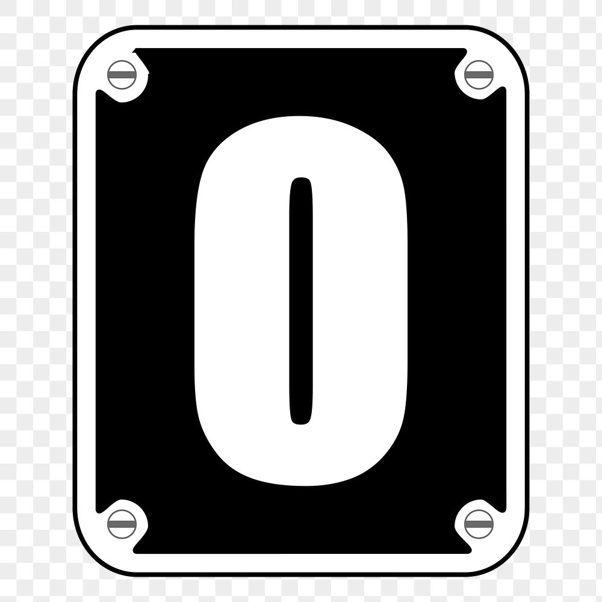

<!-- PROJECT LOGO -->
 

  

  <h3 align="center">GAN number generator</h3>

  

    Let your computer create numbers! 
     
     
     
  

<!-- ABOUT THE PROJECT -->
## About The Project

The utility of this project remains in:
* Learning how a Generative Adversarial Network works
* Get some contact with MNIST images 
* Perform a generative machine learning approach in PyTorch

The files you can find in this repository is a Jupyter Notebook with all the neccesary specifications

 

## What is a GAN?

A Generative Adversarial Network (GAN) is a type of neural network architecture that consists of two main components: a generator and a discriminator. These two networks are trained simultaneously through a competitive process.

1. Generator: The generator's role is to create fake data (in our case, images) from random noise. It starts with random noise as input and gradually refines its output to generate data that is indistinguishable from real data. Its input are random noise vectors and transform them into 28x28 array images. 

2. Discriminator: The discriminator's job is to distinguish between real data and fake data generated by the generator. It starts with no prior knowledge and learns to classify data as real or fake. Its input is a 28x28 and will try to distinguish if the image is original or was produced by the generator.

The training process involves a game-like scenario where the generator tries to produce data that is so realistic that the discriminator cannot tell it apart from real data. As training progresses, both networks improve their performance, resulting in the generator creating increasingly convincing fake data. For this particular project we used a DCGAN (Deep Convolutional GAN), which uses convolutional neural networks for the generation and discrimination of images. 

## The MNIST dataset

The MNIST dataset is a widely used dataset in machine learning and computer vision. It consists of a collection of 28x28 pixel grayscale images of handwritten digits (0-9). Each image is associated with a label indicating the digit it represents. The MNIST dataset is often used for tasks like digit recognition and serves as a benchmark for various machine learning algorithms. In this project, we use the MNIST dataset as our real data to train the DCGAN. The goal is to train the generator to produce realistic-looking handwritten digit images similar to those found in MNIST. By training the DCGAN on the MNIST dataset, we aim to demonstrate how GANs can be used to generate data that closely resembles real-world examples and how DCGANs, in particular, can be employed for image generation tasks.

### Built With

* [PyTorch]()
* [Torchvision]()
* [Numpy]()
* [Matplotlib]()

(<a href="#top">back to top</a>)

