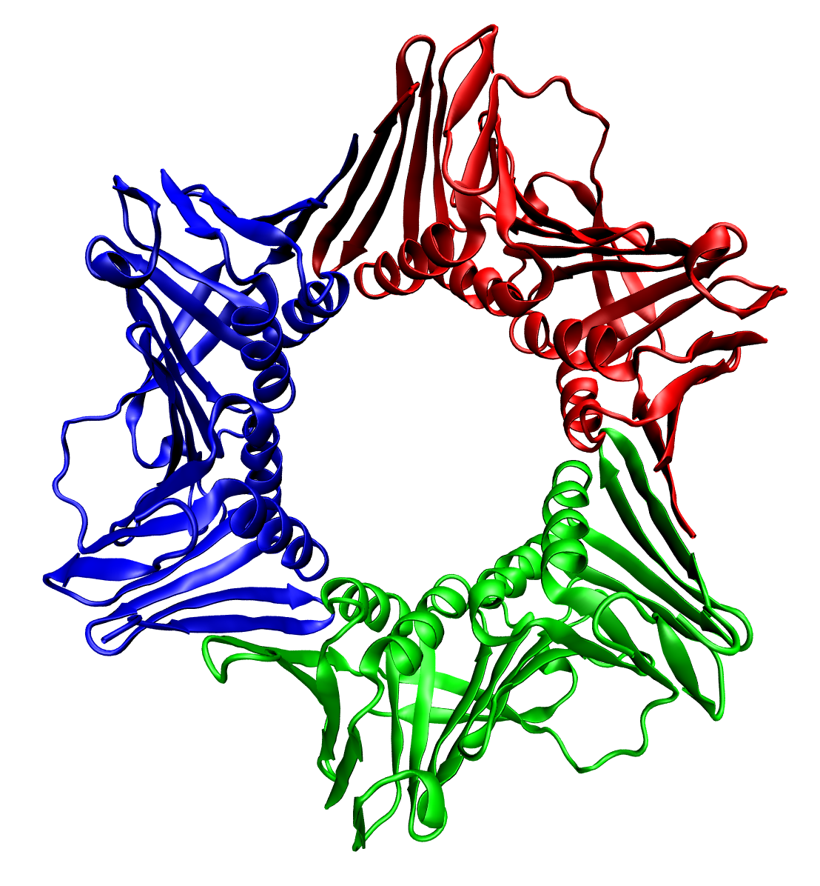

<!-- PROJECT LOGO -->
 

  

  <h3 align="center">HMM-profiler</h3>

  

    Read your proteins secrets
     
    <a href="https://github.com/Gero1999/code/edit/main/Python/HMM_profile_analyser"><strong>Explore the docs »</strong></a>
     
     
  

<!-- ABOUT THE PROJECT -->
## About The Project

The utility of this project remains in:
* Capturing the biological features and characteristics behind a protein family
* Using basic code to build simple HMM models
* Evaluate new potential proteins belonging to the identified family

The files you can find in this repository are:

1) **HMM_profiler.** Given a set of sequences (presumably from the same protein family) it constructs a HMM model of two matrices, one revealing state transitions (being the states: Deletion, Insertion, Match) or emissions (for the 20 aminoacids).    
2) **HMM_decoder_and_evaluator.** Given a HMM profile involving two matrices (state transition and residue emission) the function can generate the most probable sequence, or alternatively given one sequence calculate its probability to be part of the considered family.

 

### Built With

* [Pandas]()
* [Numpy]()
* [Collections]()

(<a href="#top">back to top</a>)

<!-- USAGE EXAMPLES -->
## Usage

You can actually see a practical example with short TAF sequences in the next [streamlit app](https://gero1999-code-streamlitprot-profiler-appapp-uorzny.streamlitapp.com/)

(<a href="#top">back to top</a>)

<!-- ADDITIONALLY -->
## Contact

The protein represented in the entrance of the document is the human PCNA (1AXC), you can read more about it or obtain the image in [Wikipedia](https://da.wikipedia.org/wiki/Fil:1axc_tricolor.png)

(<a href="#top">back to top</a>)

