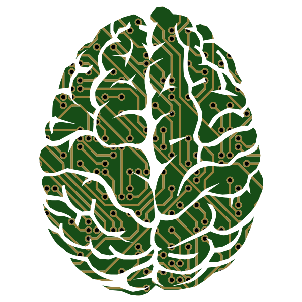

<!-- PROJECT LOGO -->
 

  

  <h3 align="center">Machine Learning algorithm implementations from scratch</h3>

  

    Learn how your neurons learn! 
     
    <a href="https://github.com/Gero1999/code/edit/main/Python/ML_implementations"><strong>Explore the docs »</strong></a>
     
     
  

The primary goal of this repository is to provide hands-on experience in implementing machine learning algorithms without relying on pre-built libraries. By diving into the code and understanding the mathematical concepts behind these algorithms, you can strengthen your knowledge and intuition in machine learning.

## Implemented Algorithms

### 1. Logistic Regression

**Description:**
Logistic regression is a binary classification algorithm that models the probability of a sample belonging to a particular class. It's a fundamental building block for more complex algorithms and is widely used in various applications.

**Mathematics:**
Logistic regression involves the sigmoid function for modeling probabilities:

Where:
- **z**: Represents the linear combination of features.

The sigmoid function maps the linear combination of features (z) to a value between 0 and 1, which can be interpreted as the probability of a sample belonging to the positive class.

And the cost function (cross-entropy loss) for optimizing model parameters:

Where:
- **J(𝜃)**: Represents the cost associated with the current model parameters 𝜃.
- **m**: Represents the number of training examples.
- **y^(i)**: Represents the actual target (0 or 1) for the ith training example.
- **h(x^(i))**: Represents the predicted probability that the ith training example belongs to the positive class.

### 2. K-Means Clustering

**Description:**
K-Means clustering is an unsupervised machine learning algorithm used for partitioning a dataset into clusters or groups based on similarity. It aims to minimize the within-cluster variance while maximizing the between-cluster variance.

**Mathematics:**
K-Means involves the following key steps:

1. Initialization: Randomly select 'k' initial cluster centroids, where 'k' is the number of clusters you want to create.

2. Assignment: For each data point, calculate its distance to each centroid and assign it to the cluster with the nearest centroid. This is typically done using Euclidean distance:

   

   Where:
   - **x**: Represents a data point's coordinates.
   - **c**: Represents a centroid's coordinates.

3. Update: Recalculate the centroids for each cluster as the mean of all data points assigned to that cluster:

   

   Where:
   - **c_i**: Represents the new centroid for cluster 'i'.
   - **S_i**: Represents the set of data points in cluster 'i'.
   - **x**: Represents a data point.

4. Repeat: Steps 2 and 3 are repeated iteratively until convergence. Convergence is typically achieved when the centroids no longer change significantly or after a fixed number of iterations.

**Parameters:**
- **k**: The number of clusters to create.
- **Initialization method**: Methods for selecting initial centroids (e.g., random initialization, k-means++).
- **Convergence criteria**: Conditions for stopping the iterations (e.g., a maximum number of iterations or minimal centroid movement).

### 3. Neural Networks

**Description:**
Neural Networks, also known as Artificial Neural Networks (ANNs), are a fundamental concept in deep learning and machine learning. They are designed to mimic the structure and functioning of the human brain to solve complex tasks, including classification, regression, and pattern recognition.

**Architecture:**
A neural network consists of three main types of layers:
1. **Input Layer**: Receives input features.
2. **Hidden Layers**: Comprise one or more layers between the input and output layers. These layers contain neurons (or nodes) that process information using activation functions.
3. **Output Layer**: Produces the final output of the network, which depends on the specific task (e.g., classification or regression).

**Mathematics:**
Neural networks perform a series of operations to make predictions or classifications. Key mathematical concepts include:

1. **Linear Combination (Weighted Sum)**:
   For each neuron in a layer (except the input layer), compute a weighted sum of inputs, including a bias term:
   
   

   Where:
   - **z_j**: Weighted sum for neuron j.
   - **w_{ij}**: Weight connecting neuron i to neuron j.
   - **x_i**: Output from neuron i in the previous layer.
   - **b_j**: Bias term for neuron j.

2. **Activation Function**:
   Apply an activation function to the weighted sum to introduce non-linearity. Common activation functions include:
   
   - **Sigmoid**: Used for binary classification.
   - **ReLU (Rectified Linear Unit)**: Commonly used in hidden layers.
   - **Softmax**: Used in the output layer for multiclass classification.

3. **Forward Propagation**:
   The output of one layer becomes the input for the next layer, propagating through the network. This process continues until the output layer produces the final result.

4. **Loss Function**:
   A loss function measures the difference between predicted and actual values. Common loss functions include:
   
   - **Mean Squared Error (MSE)**: Used for regression tasks.
   - **Cross-Entropy Loss**: Used for classification tasks.

### 4. Autoencoders

**Description:**
Autoencoders are a type of artificial neural network used for unsupervised learning and dimensionality reduction. They are primarily employed for feature learning, data compression, and anomaly detection.

**Architecture:**
Autoencoders consist of two main components:
1. **Encoder**: This part of the network compresses the input data into a lower-dimensional representation, often called the encoding or bottleneck layer.
2. **Decoder**: The decoder takes the compressed representation and attempts to reconstruct the original input data.

**Mathematics:**
Autoencoders use a loss function to measure the difference between the input and the reconstructed output. Key mathematical components include:

1. **Encoding Function (Encoder)**:
   - The encoder reduces the input data into a lower-dimensional representation using a set of weights and biases.
   - The encoding function can be represented as:
   
   

   Where:
   - **h**: Encoded representation.
   - **W**: Weight matrix.
   - **x**: Input data.
   - **b**: Bias term.

2. **Decoding Function (Decoder)**:
   - The decoder attempts to reconstruct the original input data from the encoded representation.
   - The decoding function can be represented as:
   
   

   Where:
   - **x̂**: Reconstructed input data.
   - **W'**: Weight matrix.
   - **h**: Encoded representation.
   - **b'**: Bias term.

3. **Loss Function**:
   - Autoencoders use a loss function to measure the dissimilarity between the input data and the reconstructed data.
   - Common loss functions include Mean Squared Error (MSE) or Binary Cross-Entropy, depending on the type of data.

**Training:**
Autoencoders are trained using unlabeled data. The training process aims to minimize the loss function by adjusting the weights and biases in both the encoder and decoder.

**Applications:**
Autoencoders have various applications, including:
- Image denoising: Removing noise from images.
- Anomaly detection: Identifying unusual patterns in data.
- Feature learning: Extracting informative features from data.
- Data compression: Reducing the dimensionality of data while preserving important information.

Autoencoders are versatile and find use in domains such as computer vision, natural language processing, and data analysis.

## Built With

* [Numpy]()
* [Collections]()

