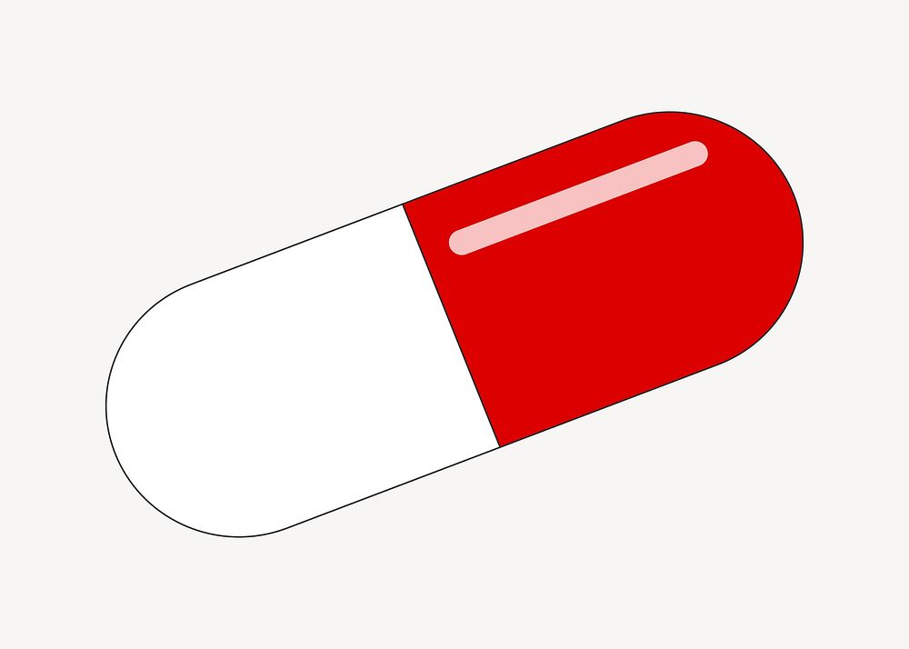

<!-- PROJECT LOGO -->
 

  

  <h3 align="center">Pharmaceutical names generator</h3>

  

    Give it a start and it will generate a name for your product!
     
    <a href="https://github.com/Gero1999/code/edit/main/Python/HMM_profile_analyser"><strong>Explore the docs »</strong></a>
     
     
  

<!-- ABOUT THE PROJECT -->
## About The Project

The utility of this project remains in:
* Produce "credible" comercial pharmaceutical names given a variable length input 
* Creating a tokenizer with TensorFlow
* Natural Language Generation based on Neural Networks

 

## How the Neural Network works

This model is designed for processing sequences (that are a result of tokenizing and paddding words) to extract meaningful information from them. It combines several neural network layers to achieve this. Let's break down how it works step by step:

1. Embedding Layer: The model starts with an embedding layer. This layer is responsible for converting discrete data, such as words or characters, into continuous vectors. In this case, it represents the input sequence as dense vectors of dimensionality 8. This helps the model learn representations of the input data that capture semantic meaning.

2. Convolutional Layer (Conv1D): Following the embedding layer, there is a 1D convolutional layer. Convolutional layers are often used in image processing, but here, they are applied to 1D sequences. This layer performs feature extraction, identifying important patterns or features within the sequence. It uses 64 filters to capture different aspects of the input.

3. Max Pooling Layer (MaxPooling1D): After the convolutional layer, there is a max-pooling layer. This layer reduces the spatial dimensions of the extracted features by selecting the maximum value within a window of data. It helps retain the most important information while reducing the computational load.

4. LSTM Layer: The Long Short-Term Memory (LSTM) layer is a type of recurrent neural network (RNN) layer. It processes sequences and captures dependencies over time. In this model, the LSTM layer has 32 units. It learns patterns and dependencies in the data, especially useful for sequential data like text.

5. Dense Layer: Finally, there is a dense layer with 39 units. This layer serves as the output layer and produces the final predictions or representations based on the information learned from the previous layers.

Once trained, the model will be able to produce an output based on a variable-input character length, completing a word that may seeem similar to the name of a pharmaceutical!

 

### Built With

* [TensorFlow]()
* [sklearn]()
* [matplotlib]()

(<a href="#top">back to top</a>)

<!-- USAGE EXAMPLES -->
## Usage

In process

(<a href="#top">back to top</a>)

<!-- ADDITIONALLY -->
## Contact
