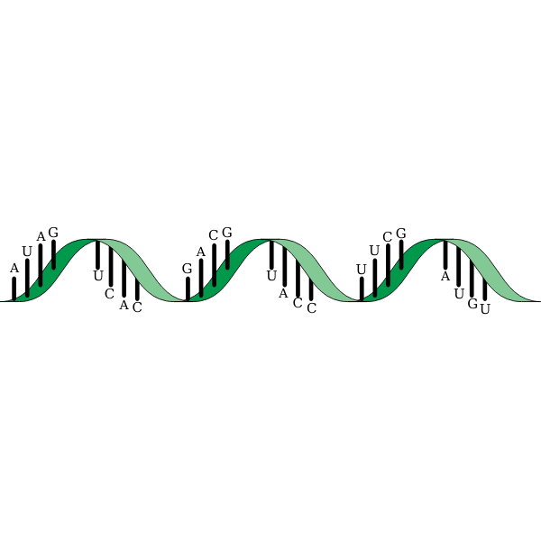

<!-- PROJECT LOGO -->
 

  

  <h3 align="center">Nussinov Algorithm</h3>

  

    Unleash RNA's secret dance of bonds and folds
     
    <a href="https://github.com/Gero1999/code/edit/main/Python/HMM_profile_analyser"><strong>Explore the docs »</strong></a>
     
     
  

<!-- ABOUT THE PROJECT -->
## About The Project

The utility of this project remains in:
* Predict a RNA molecule folding
* Use dynamic programming to find an optimal solution
* Make a graphicacl representation of the result programatically (still in process)

 

### Built With

* [Pandas]()
* [RE]()
* [Numpy]()

(<a href="#top">back to top</a>)

<!-- USAGE EXAMPLES -->
## Usage

In process

(<a href="#top">back to top</a>)

<!-- ADDITIONALLY -->
## Contact
