Poisson Regression in rjags
================
Gerardo José Rodríguez
2023-10-10

## Presenting the dataset

It was originally obtained from Kaggle, Involves hourly/monthly/yearly
USA data from 2014-2019 reporting sales in 8 different pharmaceutical
types of products. For more information you can access the next link:

<https://www.kaggle.com/datasets/ybifoundation/pharma-drug-sales>

    ## Rows: 50532 Columns: 14
    ## ── Column specification ────────────────────────────────────────────────────────
    ## Delimiter: ","
    ## chr (5): Time, Year, Month, Date, Day
    ## dbl (9): Hour, AceticAcidDerivatives, PropionicAcidDerivatives, SalicylicAci...
    ## 
    ## ℹ Use `spec()` to retrieve the full column specification for this data.
    ## ℹ Specify the column types or set `show_col_types = FALSE` to quiet this message.

    ## # A tibble: 6 × 14
    ##   Time             Year  Month Date   Hour Day      AceticAcidDerivatives
    ##   <chr>            <chr> <chr> <chr> <dbl> <chr>                    <dbl>
    ## 1 01-02-2014 08:00 2014  2     1         8 Thursday                     0
    ## 2 01-02-2014 09:00 2014  2     1         9 Thursday                     0
    ## 3 01-02-2014 10:00 2014  2     1        10 Thursday                     0
    ## 4 01-02-2014 11:00 2014  2     1        11 Thursday                     0
    ## 5 01-02-2014 12:00 2014  2     1        12 Thursday                     0
    ## 6 01-02-2014 13:00 2014  2     1        13 Thursday                     0
    ## # ℹ 7 more variables: PropionicAcidDerivatives <dbl>,
    ## #   SalicylicAcidDerivatives <dbl>, PyrazolonesAndAnilides <dbl>,
    ## #   AnxiolyticDrugs <dbl>, HypnoticsSndSedativesDrugs <dbl>,
    ## #   ObstructiveAirwayDrugs <dbl>, Antihistamines <dbl>

Adapt the dataset to work with it easily

    ## Warning: There were 2 warnings in `mutate()`.
    ## The first warning was:
    ## ℹ In argument: `Month = as.integer(Month)`.
    ## Caused by warning:
    ## ! NAs introduced by coercion
    ## ℹ Run `dplyr::last_dplyr_warnings()` to see the 1 remaining warning.

    ## # A tibble: 6 × 8
    ##   Time              Year Month Date   Hour Day      drug                   value
    ##   <chr>            <dbl> <int> <chr> <dbl> <chr>    <chr>                  <dbl>
    ## 1 01-02-2014 08:00  2014     2 1         8 Thursday PropionicAcidDerivati…  0.67
    ## 2 01-02-2014 08:00  2014     2 1         8 Thursday SalicylicAcidDerivati…  0.4 
    ## 3 01-02-2014 08:00  2014     2 1         8 Thursday PyrazolonesAndAnilides  2   
    ## 4 01-02-2014 08:00  2014     2 1         8 Thursday Antihistamines          1   
    ## 5 01-02-2014 09:00  2014     2 1         9 Thursday SalicylicAcidDerivati…  1   
    ## 6 01-02-2014 09:00  2014     2 1         9 Thursday AnxiolyticDrugs         2

My hypothesis is that certain drugs such as antihistamines or
anxiolitics should be more sold in certain months over others. Lets see
if that is true…

    ## [1] 2014 2015 2016 2017 2018 2019

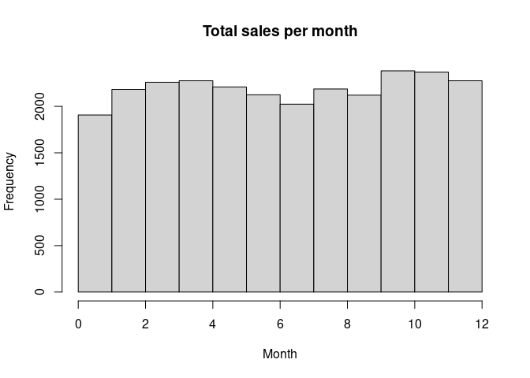<!-- -->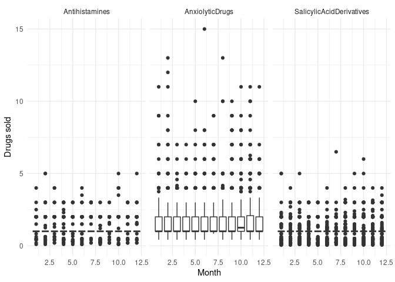<!-- -->

Based on the data most pharmaceuticals present many outliers and not
that clear differeces in their medians. Although October (month 10)
seems clearly differentiated from the others for Anviolytic drugs. Let’s
see what happens when we inspect the summed absolute values:

    ## `summarise()` has grouped output by 'Month'. You can override using the
    ## `.groups` argument.

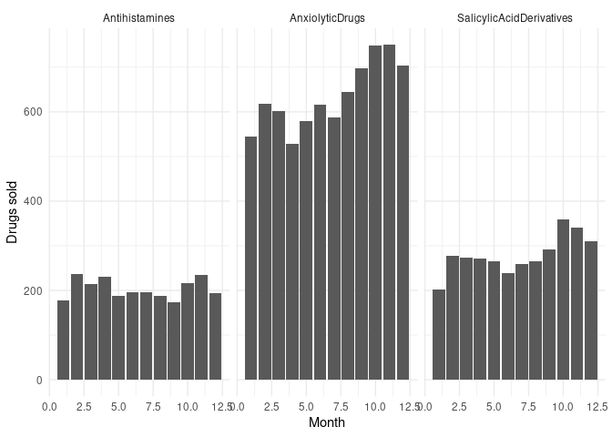<!-- -->

Here the difference seems more blatant, specially for anxyolitic drugs.
What if we use a Hierarchical Bayesian model to model the distributions?

Let’s perform now the JAGS simulation. We assume a gamma prior based on
alpha and beta hyperparameters. They two are generating our expected
number of drugs saled per month (lambda). Our lambda prior will be the
mean

    ## [1] 1.355496

    ## [1] 1.434457

    ## [1] 1.053888

    ## Compiling model graph
    ##    Resolving undeclared variables
    ##    Allocating nodes
    ## Graph information:
    ##    Observed stochastic nodes: 4235
    ##    Unobserved stochastic nodes: 14
    ##    Total graph size: 8491
    ## 
    ## Initializing model

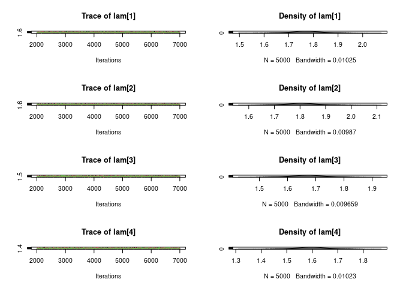<!-- -->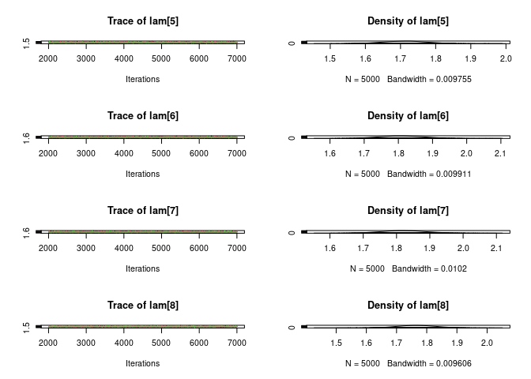<!-- -->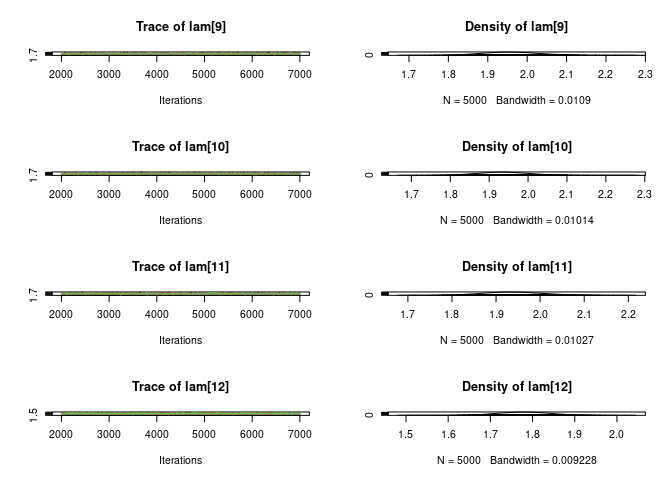<!-- -->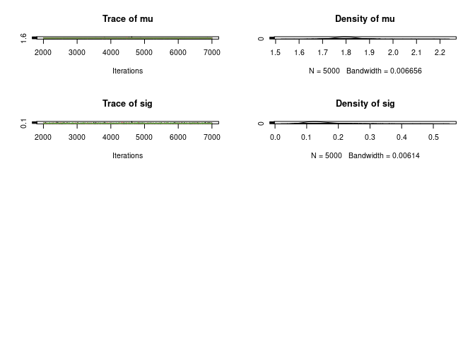<!-- -->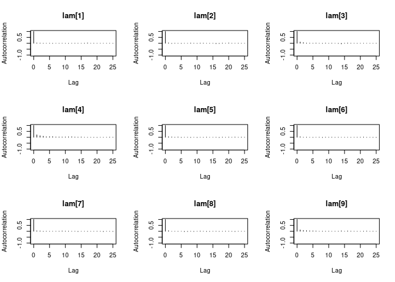<!-- -->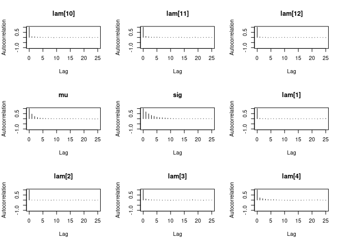<!-- -->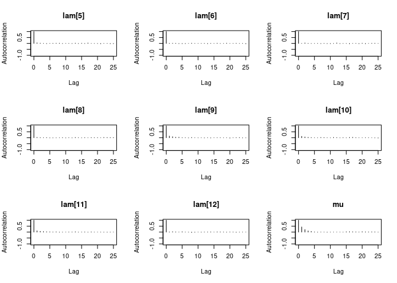<!-- -->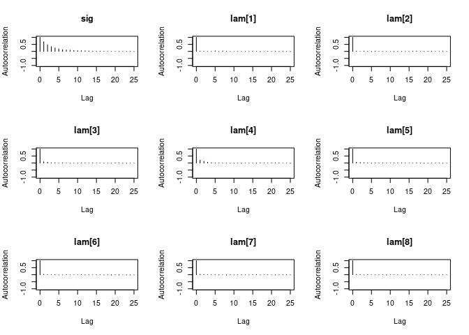<!-- -->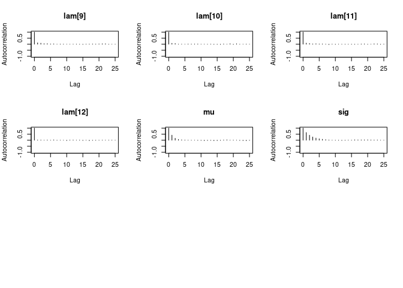<!-- -->

    ##    lam[1]    lam[2]    lam[3]    lam[4]    lam[5]    lam[6]    lam[7]    lam[8] 
    ## 13474.644 14616.068 11079.507  6911.623 12563.034 14253.151 13420.625 13764.154 
    ##    lam[9]   lam[10]   lam[11]   lam[12]        mu       sig 
    ##  8990.979 10743.867 10075.650 13939.516  5651.939  2853.204

There does not seem to be any autoccorelation and the effective sample
size is large.

# Conclusion using the posteriors

What is the probability that an anxyolitic drug will be sold more in
December than in January?

    ## [1] "Odds ratio: 1.00921418636996"

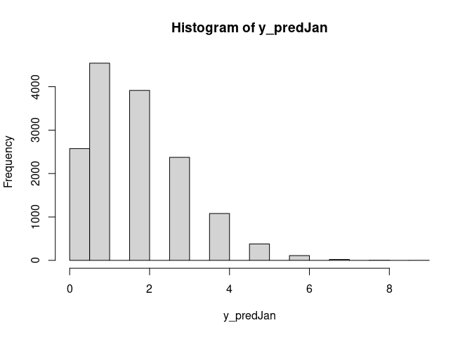<!-- -->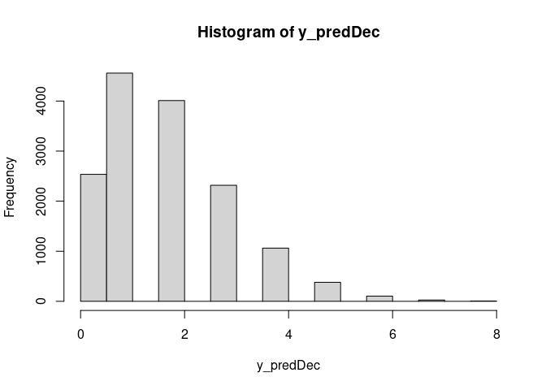<!-- -->

The odds ratio that in December are more medicines sold than in January
is superior to 1, but not very far from it. The distributions also seem
to be very similar.
