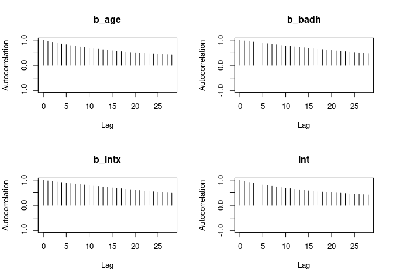
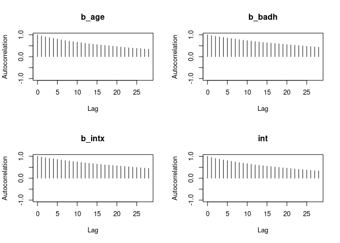
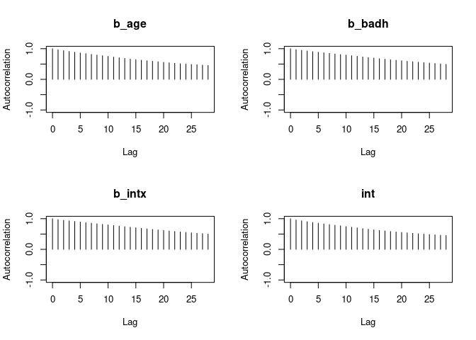
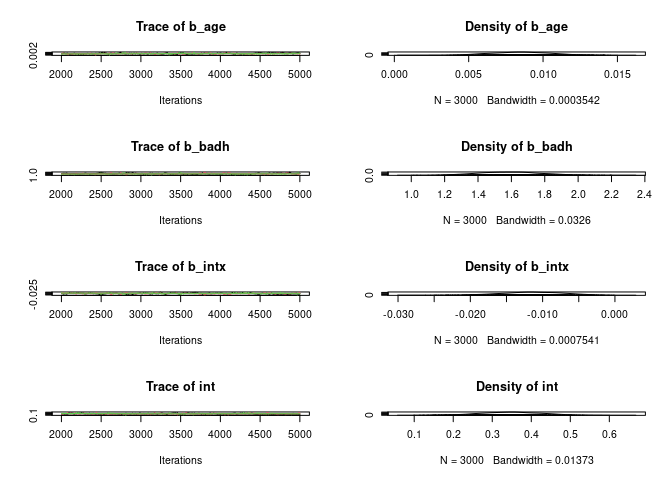
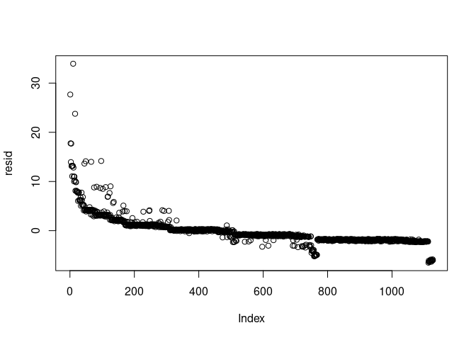
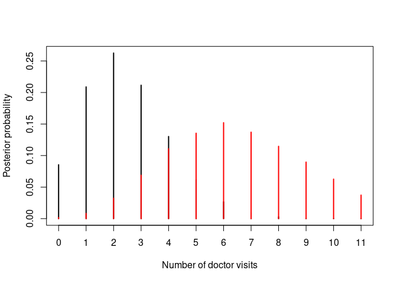

Poisson Regression in rjags
================
Gerardo José Rodríguez
2023-10-10

## Presenting the dataset

Here is the header of the data, where we can see the three variables it
consider (number of visits, badhealth (1=yes, 0=no) and age)

``` r
data("badhealth")
head(badhealth)
```

    ##   numvisit badh age
    ## 1       30    0  58
    ## 2       20    0  54
    ## 3       16    0  44
    ## 4       20    0  57
    ## 5       15    0  33
    ## 6       15    0  28

Lets make sure there is no missing data and visualize the data

``` r
any(is.na(badhealth))
```

    ## [1] FALSE

``` r
plot(jitter(log(numvisit)) ~ jitter(age), data=badhealth, subset=badh==0, xlab="age", ylab="log(visits)")
points(jitter(log(numvisit)) ~ jitter(age), data=badhealth, subset=badh==1, col="red")
```

<!-- -->

## Define the model and train it

``` r
mod_string = " model {
    for (i in 1:length(numvisit)) {
        numvisit[i] ~ dpois(lam[i])
        log(lam[i]) = int + b_badh*badh[i] + b_age*age[i] + b_intx*age[i]*badh[i]
    }
    
    int ~ dnorm(0.0, 1.0/1e6)
    b_badh ~ dnorm(0.0, 1.0/1e4)
    b_age ~ dnorm(0.0, 1.0/1e4)
    b_intx ~ dnorm(0.0, 1.0/1e4)
} "

set.seed(102)

data_jags = as.list(badhealth)

params = c("int", "b_badh", "b_age", "b_intx")

mod = jags.model(textConnection(mod_string), data=data_jags, n.chains=3)
```

    ## Compiling model graph
    ##    Resolving undeclared variables
    ##    Allocating nodes
    ## Graph information:
    ##    Observed stochastic nodes: 1127
    ##    Unobserved stochastic nodes: 4
    ##    Total graph size: 3665
    ## 
    ## Initializing model

``` r
update(mod, 1e3)

mod_sim = coda.samples(model=mod,
                        variable.names=params,
                        n.iter=3e3)
mod_csim = as.mcmc(do.call(rbind, mod_sim))

## convergence diagnostics
autocorr.plot(mod_sim)              # Plot autocorrelation within iterations
```

<!-- --><!-- --><!-- -->

``` r
plot(mod_sim, TRUE)                 # Trace plots to check convergeance
```

<!-- -->

``` r
dic = dic.samples(mod, n.iter=1e3)  # DIC calculation

print(paste0('DIC: ', mean(dic$deviance)))
```

    ## [1] "DIC: 4.99551932672855"

``` r
print(paste0('Effective size: ',    # Effective size 
             round(mean(effectiveSize(mod_sim))), 
             ' out of ', nrow(data)))           
```

    ## [1] "Effective size: 140 out of "

- The mdoel has clearly converged in all chains, thus the variance rate
  and the number of iterations seem to be right

- This is actually concerning! The variables of our model seems very
  correlated. Even if I increase the number of simulations. The points
  of the data for the model defined are perhaps not completely
  independent samples… Let’s investigate more!

# Evaluation tests

This might look bad, but there is actually no problem considering that
our data has been pre-sorted and that by model definition It is to be
expected, in Poisson likelihoods the variance increases as the mean
increases.

``` r
X = as.matrix(badhealth[,-1])
X = cbind(X, with(badhealth, badh*age))
pmed_coef = apply(mod_csim, 2, median)
llam_hat = pmed_coef["int"] + X %*% pmed_coef[c("b_badh", "b_age", "b_intx")]
lam_hat = exp(llam_hat)
resid = badhealth$numvisit - lam_hat
plot(resid) # the data were ordered
```

<!-- -->

On the other hand, this other plot is much more troublesome, as the
model seems to be pretty much around only two values. We should concern
about the capacity of the model to truly fit this data and consider if
an alternative Negative Binomial Distribution could not be more
appropiate. However, for learning purposes I would keep working with
this one for now.

``` r
plot(lam_hat[which(badhealth$badh==0)], resid[which(badhealth$badh==0)], xlim=c(0, 8), ylab="residuals", xlab=expression(hat(lambda)), ylim=range(resid))
points(lam_hat[which(badhealth$badh==1)], resid[which(badhealth$badh==1)], col="red")
```

<!-- -->

# Make predictions

Let’s create a function that can create a posterior distribution given a
patient’s age and health-state.

``` r
predict_posterior = function(bad.health, age, prob.table = T){
  x = c(bad.health, age, bad.health*age)  # Vector input for the regression
  linear_predictor = mod_csim[,'int'] + mod_csim[,c(2,1,3)] %*% x  # Regression
  lambdas = exp(linear_predictor) # Inverse link transformation
  
  # Do n simulations and count 
  n_visits = rpois(n=length(lambdas), lambda=lambdas) # Perform simulations 
  post = table(factor(n_visits))/length(lambdas)  # Get probability proportions for each n_visits
  
  if (isFALSE(prob.table)){return(n_visits)}
  else{return(post)}
}
```

And we are gonna use this function to compare the test if an older
($x_{1.1}=65y$) and healthier person ($x_{1.2}=0$) is more likely (or
not) to have more doctors visits that someone young ($x_{2.1}=15y$) and
ill ($x_{2.2}=1$).

``` r
# Get the distribution for both cases
plot(predict_posterior(0,65), ylab='Posterior probability', xlab='Number of doctor visits', pch=3)
points(predict_posterior(1,15), col='red')
```

<!-- -->

Thanks to the bayesian thinking and by using our posterior, we can
actually measure this numerically too. The probability that the ill
15-years old person had more doctor visits in the last year than the
healthy 65 years old one is:

``` r
area_prop = mean(predict_posterior(1,15, prob.table = F) > predict_posterior(0, 65, prob.table = F)) 
print(paste0('Probaiblity: ', round(area_prop*100), '%'))
```

    ## [1] "Probaiblity: 89%"

``` r
dpois(22/2, 15)
```

    ## [1] 0.06628739
