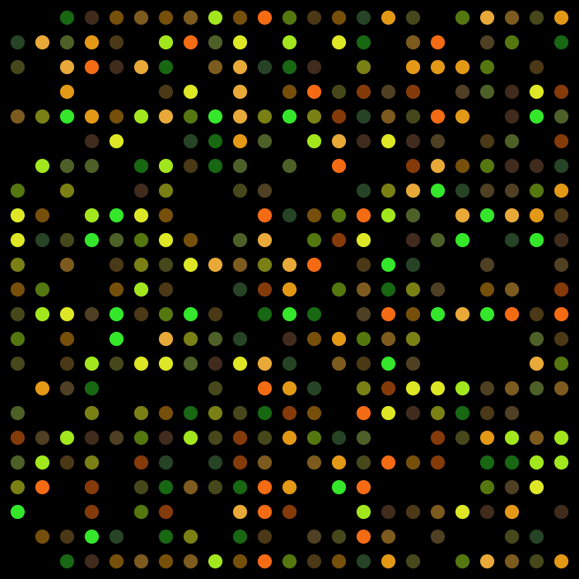

<!--

-->
[![Contributors][contributors-shield]][contributors-url]
[![Forks][forks-shield]][forks-url]
[![Stargazers][stars-shield]][stars-url]
[![Issues][issues-shield]][issues-url]
[![MIT License][license-shield]][license-url]
[![LinkedIn][linkedin-shield]][linkedin-url]

<!-- PROJECT LOGO -->
 

  

  <h3 align="center">Differential Expression Analysis</h3>

  

    Analyze multiple datasets without even sweating!
     
     
     
    <a href="https://github.com/Gero1999/code/tree/main/R/DEA">View Demo</a>
    ·
  

<!-- ABOUT THE PROJECT -->
## About The Project

The purpose of this project is to be capable of automatizing pipeline processes in order to:

* Select in a faster way from all the microarray repositories the datasets of your interest
* Simplify metadata wihtout the intervention of the user
* Elaborate an exploratory and differential expression analysis comparing two or more situations.
* Use genes significantly expressed in order to perform a pathway analysis.

### Built With R

* [Biobase]()
* [ArrayExpress]()
* [Hugene]()
* [Oligo]()
* [Limma]()
* [clusterProfiler]()
* [ggplot2]()
* [dplyr]()
* [stringr]()
* [arrayQualityMetrics]()
* [geneplotter]()
* [enrichR]()
* [vsn]()

(<a href="#top">back to top</a>)

<!-- STILL IN DEVELOP! -->

<!-- USAGE EXAMPLES -->
## Still in develop!

