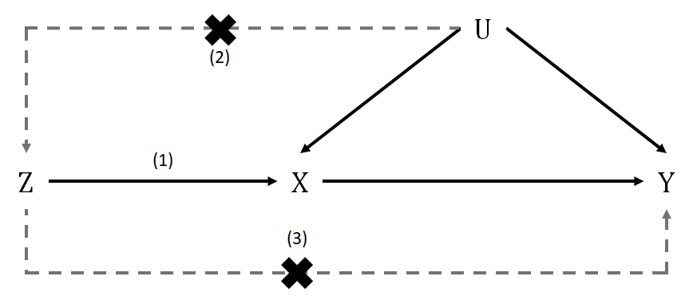

<!--

-->
[![Contributors][contributors-shield]][contributors-url]
[![Forks][forks-shield]][forks-url]
[![Stargazers][stars-shield]][stars-url]
[![Issues][issues-shield]][issues-url]
[![MIT License][license-shield]][license-url]
[![LinkedIn][linkedin-shield]][linkedin-url]

<!-- PROJECT LOGO -->
 

  

  <h3 align="center">Protein Variant Analysis</h3>

  

    Discover cause/effect relations by using merely genetics!
     
    <a href="https://github.com/Gero1999/code/new/main/R/Mendelian_Randomization"><strong>Explore the docs »</strong></a>
     
     
    <a href="https://github.com/Gero1999/code/new/main/R/Mendelian_Randomization">View Demo</a>
    ·
  

<!-- ABOUT THE PROJECT -->
## About The Project

The purpose of this project is to be capable of automatizing pipeline processes in order to:

* Make a selection of SNPs to characterize a phenotype
* Perform multiple phenotype causal inferences
* Evaluate the weaknesses or broken assumptions with sensitivity plots and tests 

### Built With R

* [Biostrings]()
* [dplyr]()
* [ggplot2]()
* [tidyverse]()
* [pheatmap]()
* [ggrepel]()
* [devtools]()
* [genetics.binaRies]()
* [openxlsx]()
* [vroom]()

(<a href="#top">back to top</a>)

<!-- USAGE EXAMPLES -->
## Still in develop!

