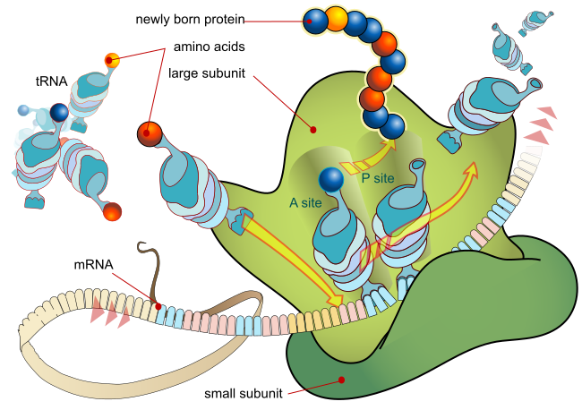

<!--

-->
[![Contributors][contributors-shield]][contributors-url]
[![Forks][forks-shield]][forks-url]
[![Stargazers][stars-shield]][stars-url]
[![Issues][issues-shield]][issues-url]
[![MIT License][license-shield]][license-url]
[![LinkedIn][linkedin-shield]][linkedin-url]

<!-- PROJECT LOGO -->
 

  

  <h3 align="center">Protein Variant Analysis</h3>

  

    Find mutations leading to critical aminoacid changes!
     
    <a href="https://github.com/othneildrew/Best-README-Template"><strong>Explore the docs »</strong></a>
     
     
    <a href="https://github.com/Gero1999/code/tree/main/R/Protein-Variant-Analyis">View Demo</a>
    ·
  

<!-- ABOUT THE PROJECT -->
## Aims of the Project

The purpose of this project is to be capable of automatizing pipeline processes in order to:

* Make an example of a native coding DNA sequence and its random mutants
* Determine the aminoacid changes that are more likely to happen
* Evaluate how these changes affect the desired function to study

## About Protein Variant Analysis
This project aims to comprehensively analyze the impact of genetic mutations on protein sequences. By simulating a set of DNA sequences with mutations, we investigate how these changes affect the translated proteins and explore the frequency of variations in specific residues. Our pipeline incorporates various tools and algorithms to facilitate a thorough examination of protein variants and their potential implications.

The pipeline is designed to handle large-scale simulations of DNA sequences with mutations, allowing for comprehensive analysis of protein variants. It performs variant annotation, protein translation, and functional prediction using state-of-the-art bioinformatics tools and databases. The pipeline also includes options for visualizing the protein structures and analyzing the potential impact on secondary and tertiary structures.

Upon completing the analysis, the pipeline generates a detailed report summarizing the results of the protein variant analysis. This report includes information on the frequency of residue changes, predicted functional effects, and structural insights. Users can interpret the results to gain a deeper understanding of the impact of genetic variations on the protein's structure and function. This pipeline is an evolving project, and we are committed to continuously improving its functionality and performance. Future updates may include enhanced visualization options, integration with additional databases and resources, and support for more sophisticated analysis methods.

### Built With R

* [Biostrings]()
* [dplyr]()
* [ggplot2]()
* [tidyverse]()
* [pheatmap]()
* [bio3d]()

(<a href="#top">back to top</a>)

<!-- STILL IN DEVELOP! -->

<!-- USAGE EXAMPLES -->
## Still in develop!

