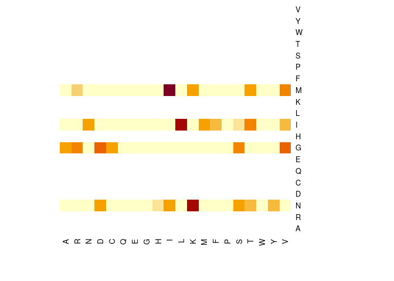
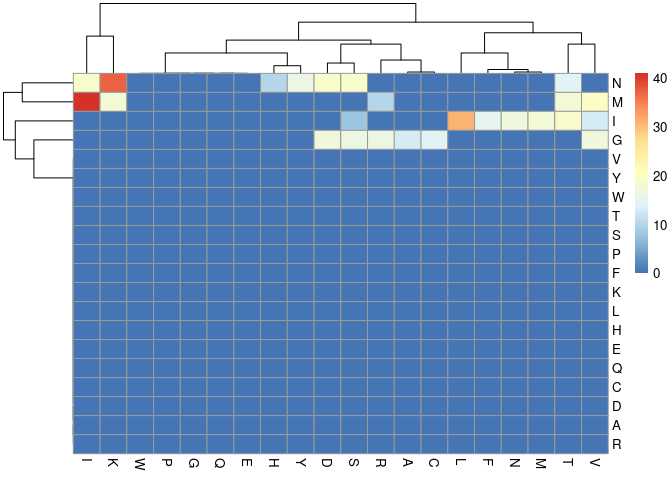
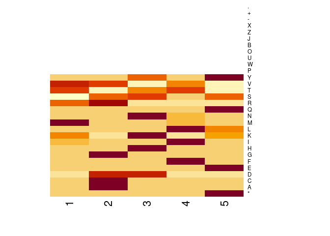

SIR Model and MCMC-MH to solve it
================
Gerardo José Rodríguez
2023-10-09

## R Markdown

Lets consider a native sequence and make a mutagenesis library. For that
we will need a random-substitution function.

``` r
# Define the initial sequence
nat =  DNAString("ATGGGTAACATCTAA")

# Alternatively read it from a FASTA file
#nat = readDNAStringSet('native_DNA.fa')[[1]]

# Define a substitution function
make_substitution = function(seq, site=FALSE, nucl=FALSE){
  if (site==FALSE){site=sample(c(1:nchar(seq)),1)}
  if (nucl==FALSE){nucl=sample(c('A','C','G','T'),1)}
  c(seq=replaceLetterAt(seq, at=site, nucl),
    mut=c(paste0(site, nat[site],'>',nucl)))}

# Perform the function over a set of your original sequence
set = rep(DNAStringSet(nat),1000)
set = lapply(set, \(dna) make_substitution(dna)$seq)
```

### Determine frequency at each position of each nucleotide

``` r
cm_dna = consensusMatrix(DNAStringSet(set))[DNA_BASES,]
cm_dna
```

    ##   [,1] [,2] [,3] [,4] [,5] [,6] [,7] [,8] [,9] [,10] [,11] [,12] [,13] [,14]
    ## A  944   18   14   16   17   15  955  948   16   941    17    18    12   947
    ## C   20   18   17   16   13   13   10   14  942    31    19   944    14    17
    ## G   20   10  959  954  953   13   19   19   21    13     8    18    13    23
    ## T   16  954   10   14   17  959   16   19   21    15   956    20   961    13
    ##   [,15]
    ## A   956
    ## C    13
    ## G    14
    ## T    17

### Determine frequency at each position of each residue

``` r
# Translate your DNA set to a protein set
prot_set = AAStringSet(lapply(DNAStringSet(set), \(x) translate(x)))

resFreqPerPos = function(prot_set){
  # Build a count matrix
  cm_res = consensusMatrix(AAStringSet(prot_set))
  # Determine which AA are not represented to complete the table content with 0s
  AAtoAdd = setdiff(AA_ALPHABET, rownames(cm_res))
  rbind(cm_res, matrix(0, nrow=length(AAtoAdd), ncol=ncol(cm_res),
                       dimnames=list(AAtoAdd, 1:ncol(cm_res))))
}
resFreqPerPos(prot_set)
```

    ##     1   2   3   4   5
    ## *   0   0   0   0 901
    ## A   0  13   0   0   0
    ## C   0  14   0   0   0
    ## D   0  17  19   0   0
    ## E   0   0   0   0  13
    ## F   0   0   0  15   0
    ## G   0 907   0   0   0
    ## H   0   0  10   0   0
    ## I  41   0  19 879   0
    ## K  18   0  37   0  12
    ## L   0   0   0  31  13
    ## M 893   0   0  18   0
    ## N   0   0 866  17   0
    ## Q   0   0   0   0  14
    ## R  10  16   0   0   0
    ## S   0  16  19   8  17
    ## T  18   0  14  19   0
    ## V  20  17   0  13   0
    ## Y   0   0  16   0  30
    ## P   0   0   0   0   0
    ## W   0   0   0   0   0
    ## U   0   0   0   0   0
    ## O   0   0   0   0   0
    ## B   0   0   0   0   0
    ## J   0   0   0   0   0
    ## Z   0   0   0   0   0
    ## X   0   0   0   0   0
    ## -   0   0   0   0   0
    ## +   0   0   0   0   0
    ## .   0   0   0   0   0

# Determine each residue-pair substitution frequence

``` r
# I CREATED TWO POTENTIAL FUNCTIONS. THE SECOND ONE IS ALMOST 5x FASTER, BUT DO NOT CREATE STANDARD TABLES (ONLY NECESSARY AMINOACIDS WITH AT LEAST ONE COUNT)
nat_prot = translate(nat)

subMtx = function(prot_set, nat_prot=NULL){
  
  # Create a consensus protein (in case is not given)
  if (is.null(nat_prot)){nat_prot=consensusString(prot_set)}
  
  # Align its sequence with the variants set
  prot_set_aligned = pairwiseAlignment(prot_set, nat_prot)
  
  # Align sequences and find all mismatches. Group substitutions together
  AAtoAA = mismatchSummary(prot_set_aligned)$subject %>%
    group_by(Subject, Pattern) %>%
    suppressWarnings(summarize(Count=sum(Count))) 
    
  # Create a substitution matrix and fill it with the substitution counts
  sub_mtx = matrix(data=0, nrow=length(AA_ALPHABET), ncol=length(AA_ALPHABET), 
                   dimnames = list(AA_ALPHABET, AA_ALPHABET))
    
  sub_mtx[cbind(AAtoAA$Subject, AAtoAA$Pattern)] = AAtoAA$Count
  return(sub_mtx)
  }
```

## Make some relevant plots of the results

``` r
library(pheatmap)
# Heatmap of pair-substitution frequence
heatmap(subMtx(prot_set, nat_prot)[AA_STANDARD, AA_STANDARD], 
        Rowv = NA, Colv = NA)
```

<!-- -->

``` r
pheatmap(subMtx(prot_set, nat_prot)[AA_STANDARD, AA_STANDARD])
```

<!-- -->

``` r
# Heatmap of residue presence per position
heatmap(resFreqPerPos(prot_set),
        Rowv = NA, Colv = NA)
```

<!-- -->

Now we would like to extract some information from these sequences.
Let’s see if we can create a function identyfying the mismatches between
two sequences

``` r
# Function where you introduce 
find_subs_dna = function(dna1, dna2, do_align=FALSE){
  positions = which(!as.integer(dna1)==as.integer(dna2))
  sapply(positions, \(pos) paste0(pos, dna1[pos], '>', dna2[pos]))
}
# Apply through all the sequences
unlist(sapply(set, \(dna) find_subs_dna(nat, dna)))
```

    ##   [1] "9C>G"  "1A>C"  "11T>C" "14A>G" "11T>A" "14A>G" "4G>A"  "12C>A" "3G>T" 
    ##  [10] "6T>C"  "7A>C"  "12C>T" "13T>G" "14A>G" "8A>T"  "10A>C" "14A>C" "14A>G"
    ##  [19] "9C>A"  "3G>A"  "14A>G" "2T>C"  "5G>T"  "8A>C"  "7A>C"  "14A>T" "6T>A" 
    ##  [28] "14A>C" "10A>T" "11T>C" "12C>T" "2T>A"  "9C>A"  "6T>C"  "9C>T"  "3G>A" 
    ##  [37] "2T>A"  "3G>C"  "4G>A"  "15A>C" "11T>G" "12C>A" "1A>G"  "1A>C"  "8A>C" 
    ##  [46] "11T>A" "12C>G" "9C>A"  "10A>G" "1A>T"  "8A>G"  "14A>C" "1A>C"  "6T>C" 
    ##  [55] "14A>C" "7A>G"  "3G>A"  "6T>C"  "12C>A" "4G>T"  "6T>C"  "4G>A"  "9C>T" 
    ##  [64] "8A>G"  "10A>G" "3G>A"  "10A>T" "9C>A"  "1A>C"  "12C>T" "11T>C" "12C>G"
    ##  [73] "10A>T" "12C>A" "5G>C"  "2T>G"  "3G>T"  "14A>T" "13T>A" "10A>T" "1A>T" 
    ##  [82] "9C>T"  "6T>C"  "7A>T"  "4G>T"  "1A>C"  "9C>T"  "8A>T"  "2T>C"  "15A>C"
    ##  [91] "11T>G" "15A>T" "15A>C" "1A>G"  "14A>C" "5G>A"  "10A>C" "6T>A"  "7A>T" 
    ## [100] "12C>T" "9C>G"  "12C>T" "9C>G"  "15A>T" "6T>C"  "1A>T"  "6T>G"  "13T>A"
    ## [109] "10A>C" "14A>G" "15A>C" "8A>T"  "6T>G"  "6T>G"  "3G>C"  "12C>T" "3G>C" 
    ## [118] "10A>C" "2T>G"  "8A>G"  "8A>T"  "4G>T"  "7A>T"  "13T>A" "1A>G"  "14A>C"
    ## [127] "8A>T"  "5G>C"  "13T>G" "9C>G"  "7A>T"  "10A>G" "14A>T" "10A>C" "5G>A" 
    ## [136] "11T>A" "6T>G"  "14A>T" "1A>G"  "5G>A"  "9C>T"  "5G>A"  "5G>C"  "12C>T"
    ## [145] "2T>A"  "13T>G" "11T>A" "7A>G"  "7A>T"  "15A>C" "12C>A" "1A>C"  "4G>A" 
    ## [154] "6T>C"  "6T>A"  "11T>C" "8A>C"  "1A>C"  "12C>T" "2T>C"  "13T>G" "13T>A"
    ## [163] "5G>A"  "14A>G" "7A>G"  "11T>C" "7A>G"  "15A>T" "4G>T"  "3G>C"  "13T>C"
    ## [172] "14A>G" "2T>C"  "5G>C"  "13T>G" "11T>C" "8A>G"  "10A>C" "8A>T"  "2T>A" 
    ## [181] "3G>T"  "4G>C"  "2T>A"  "12C>G" "1A>G"  "3G>A"  "6T>A"  "14A>T" "13T>C"
    ## [190] "2T>G"  "10A>C" "5G>A"  "12C>T" "11T>G" "5G>A"  "1A>T"  "5G>T"  "15A>T"
    ## [199] "2T>C"  "11T>C" "4G>C"  "4G>T"  "9C>G"  "6T>A"  "10A>C" "15A>T" "11T>C"
    ## [208] "1A>C"  "15A>G" "14A>C" "1A>C"  "7A>T"  "11T>C" "15A>G" "1A>G"  "2T>A" 
    ## [217] "13T>A" "7A>T"  "12C>G" "6T>A"  "11T>G" "7A>G"  "15A>T" "5G>T"  "12C>G"
    ## [226] "7A>G"  "7A>C"  "4G>C"  "5G>C"  "10A>C" "3G>T"  "1A>G"  "1A>T"  "9C>T" 
    ## [235] "11T>A" "3G>A"  "4G>T"  "10A>C" "7A>C"  "7A>G"  "4G>T"  "3G>A"  "12C>A"
    ## [244] "1A>G"  "14A>G" "6T>C"  "9C>T"  "13T>C" "15A>G" "11T>A" "15A>T" "15A>G"
    ## [253] "10A>G" "12C>T" "5G>T"  "1A>C"  "2T>A"  "10A>C" "1A>G"  "4G>T"  "7A>G" 
    ## [262] "9C>A"  "10A>G" "1A>G"  "7A>C"  "15A>T" "10A>C" "5G>T"  "12C>A" "2T>C" 
    ## [271] "15A>T" "5G>A"  "3G>C"  "9C>T"  "9C>G"  "14A>C" "2T>A"  "2T>A"  "1A>C" 
    ## [280] "14A>T" "1A>G"  "15A>G" "5G>T"  "5G>T"  "3G>C"  "11T>A" "4G>C"  "6T>G" 
    ## [289] "9C>G"  "8A>T"  "6T>G"  "9C>A"  "8A>T"  "2T>C"  "14A>T" "7A>G"  "14A>C"
    ## [298] "4G>A"  "2T>C"  "14A>C" "11T>A" "4G>C"  "5G>T"  "8A>C"  "10A>G" "7A>G" 
    ## [307] "9C>A"  "4G>A"  "10A>C" "9C>G"  "8A>T"  "6T>A"  "14A>G" "6T>A"  "7A>G" 
    ## [316] "4G>A"  "10A>T" "4G>C"  "9C>T"  "3G>C"  "8A>C"  "9C>A"  "10A>T" "14A>T"
    ## [325] "4G>T"  "1A>G"  "3G>C"  "11T>A" "3G>A"  "3G>T"  "3G>A"  "1A>G"  "2T>C" 
    ## [334] "1A>G"  "11T>C" "5G>A"  "4G>T"  "8A>G"  "12C>A" "13T>G" "5G>T"  "11T>C"
    ## [343] "11T>A" "11T>G" "8A>G"  "8A>G"  "14A>C" "12C>G" "8A>T"  "9C>G"  "10A>C"
    ## [352] "1A>G"  "4G>C"  "15A>G" "12C>A" "2T>G"  "1A>C"  "10A>C" "14A>G" "13T>C"
    ## [361] "3G>C"  "8A>C"  "9C>A"  "8A>T"  "15A>G" "12C>G" "15A>T" "9C>G"  "3G>T" 
    ## [370] "13T>G" "12C>G" "5G>A"  "3G>T"  "12C>G" "5G>C"  "10A>G" "13T>A" "13T>G"
    ## [379] "10A>C" "7A>C"  "6T>A"  "2T>C"  "4G>A"  "9C>T"  "12C>A" "8A>C"  "15A>C"
    ## [388] "11T>A" "7A>C"  "11T>C" "13T>A" "14A>G" "10A>T" "7A>T"  "1A>T"  "4G>T" 
    ## [397] "9C>G"  "8A>G"  "12C>T" "8A>G"  "2T>C"  "1A>C"  "7A>G"  "1A>T"  "13T>A"
    ## [406] "14A>G" "14A>G" "3G>A"  "10A>C" "12C>A" "12C>G" "8A>C"  "4G>C"  "2T>A" 
    ## [415] "6T>A"  "4G>A"  "7A>C"  "5G>T"  "15A>G" "7A>T"  "2T>C"  "15A>C" "14A>C"
    ## [424] "3G>C"  "15A>T" "1A>C"  "13T>C" "7A>G"  "6T>A"  "10A>G" "10A>G" "5G>C" 
    ## [433] "4G>C"  "10A>C" "9C>G"  "14A>G" "3G>T"  "15A>G" "3G>C"  "15A>C" "8A>T" 
    ## [442] "12C>G" "1A>G"  "2T>G"  "3G>A"  "2T>C"  "5G>A"  "12C>A" "5G>A"  "10A>T"
    ## [451] "2T>C"  "10A>C" "12C>T" "2T>C"  "12C>T" "6T>G"  "14A>G" "1A>C"  "13T>G"
    ## [460] "11T>A" "12C>T" "9C>T"  "12C>T" "11T>C" "3G>A"  "8A>G"  "10A>C" "12C>T"
    ## [469] "9C>T"  "5G>C"  "15A>C" "7A>T"  "6T>A"  "9C>A"  "10A>T" "2T>G"  "4G>A" 
    ## [478] "1A>C"  "10A>T" "11T>A" "8A>C"  "8A>C"  "5G>T"  "6T>G"  "14A>G" "9C>G" 
    ## [487] "12C>G" "8A>G"  "5G>C"  "14A>G" "2T>A"  "8A>C"  "8A>C"  "9C>T"  "5G>T" 
    ## [496] "7A>T"  "15A>T" "2T>A"  "10A>C" "12C>G" "15A>G" "10A>G" "1A>T"  "10A>C"
    ## [505] "1A>C"  "12C>T" "12C>A" "15A>C" "13T>G" "8A>T"  "7A>T"  "6T>C"  "7A>G" 
    ## [514] "12C>A" "5G>T"  "3G>C"  "1A>C"  "1A>T"  "11T>C" "4G>T"  "13T>A" "14A>C"
    ## [523] "7A>G"  "13T>C" "8A>T"  "1A>G"  "4G>C"  "13T>A" "3G>C"  "14A>C" "7A>G" 
    ## [532] "11T>G" "9C>T"  "6T>C"  "8A>C"  "15A>G" "2T>G"  "11T>G" "4G>A"  "11T>A"
    ## [541] "5G>C"  "11T>G" "2T>G"  "2T>G"  "9C>A"  "8A>G"  "9C>T"  "7A>C"  "8A>G" 
    ## [550] "1A>T"  "5G>C"  "10A>C" "10A>T" "2T>C"  "11T>A" "4G>C"  "2T>A"  "15A>G"
    ## [559] "8A>G"  "9C>G"  "6T>G"  "8A>G"  "1A>T"  "9C>A"  "11T>C" "4G>C"  "1A>T" 
    ## [568] "4G>A"  "1A>T"  "9C>T"  "10A>G" "13T>C" "14A>G" "7A>T"  "13T>C" "8A>G" 
    ## [577] "1A>T"  "12C>T" "7A>G"  "13T>C" "13T>G" "13T>C" "13T>C" "6T>A"  "8A>T" 
    ## [586] "1A>G"  "7A>T"  "4G>A"  "2T>C"  "7A>T"  "13T>C" "3G>C"  "8A>G"  "6T>G" 
    ## [595] "3G>C"  "15A>G" "12C>G" "4G>C"  "2T>G"  "13T>G" "13T>A" "12C>A" "11T>C"
    ## [604] "9C>G"  "5G>C"  "10A>T" "10A>C" "6T>A"  "2T>C"  "9C>A"  "15A>G" "9C>A" 
    ## [613] "9C>T"  "10A>C" "14A>G" "9C>A"  "4G>A"  "6T>G"  "9C>G"  "5G>A"  "10A>C"
    ## [622] "5G>C"  "4G>C"  "5G>T"  "5G>T"  "3G>C"  "4G>T"  "4G>T"  "1A>G"  "15A>T"
    ## [631] "6T>G"  "11T>A" "10A>G" "14A>C" "11T>C" "14A>C" "9C>G"  "7A>T"  "1A>C" 
    ## [640] "9C>T"  "13T>G" "6T>A"  "10A>T" "14A>G" "15A>C" "12C>G" "14A>T" "2T>A" 
    ## [649] "14A>T" "7A>G"  "11T>C" "15A>T" "8A>T"  "10A>C" "10A>G" "14A>T" "9C>G" 
    ## [658] "9C>T"  "12C>T" "7A>C"  "8A>T"  "9C>G"  "8A>T"  "14A>C" "12C>A" "9C>G" 
    ## [667] "6T>C"  "3G>T"  "3G>A"  "8A>C"  "6T>C"  "8A>G"  "11T>A" "1A>G"  "14A>G"
    ## [676] "11T>C" "5G>A"  "7A>G"  "5G>A"  "12C>G" "15A>T" "14A>T" "3G>C"  "13T>A"
    ## [685] "1A>C"  "13T>C" "3G>T"  "2T>A"  "5G>A"  "12C>T" "1A>T"  "4G>A"  "9C>T" 
    ## [694] "13T>C" "12C>A" "15A>T" "4G>C"  "6T>G"  "10A>C" "12C>G" "10A>T" "14A>G"
    ## [703] "4G>C"  "15A>C" "15A>T" "1A>T"  "9C>A"  "10A>C" "12C>G" "4G>A"  "12C>A"
    ## [712] "2T>A"  "5G>A"  "10A>C" "8A>T"  "15A>C" "9C>T"  "2T>A"  "10A>T" "2T>A" 
    ## [721] "3G>A"  "9C>G"  "10A>C" "8A>G"  "5G>T"  "5G>T"  "14A>T"

# ALL FUNCTIONS

## In case you want to use them without analyzing them one by one

``` r
make_substitution = function(seq, site=FALSE, nucl=FALSE){
  if (site==FALSE){site=sample(c(1:nchar(seq)),1)}
  if (nucl==FALSE){nucl=sample(c('A','C','G','T'),1)}
  c(seq=replaceLetterAt(seq, at=site, nucl),
    mut=c(paste0(site, nat[site],'>',nucl)))}

freq_mtx = function(setSeqs, natProt=NULL, justSubs=F, as.prob=T){
  # Determine if there is a DNA or protein set
  if(class(setSeqs)=='AAStringSet'){alphabet=AA_ALPHABET}
  else if(class(setSeqs)=='DNAStringSet'){alphabet=DNA_ALPHABET}
  else{return(print('Introduce a Biostrings AAStringSet/DNAStringSet'))}
  
  # Determine residue's frequence at each position
  freq_mtx = as.matrix(setSeqs) %>% 
  as.data.frame() %>%
  apply(., 2, function(col){
  table(c(col, alphabet))-1}) 
  
  # Name columns as sequence-position + letter (if native seq is specified)
  if (is.null(natProt)){colnames(freq_mtx) = 1:ncol(freq_mtx)}
  else {colnames(freq_mtx) = paste0(1:nchar(natProt), as.vector(natProt))}
  
  # Keep or not the equal subs
  if (!is.null(natProt) && justSubs==T){
    for (l in 1:nchar(natProt)){freq_mtx[as.character(as.vector(natProt)[l]),l] =0 }
  }
  # Return the output
  if (as.prob==T) {return(freq_mtx/sum(freq_mtx))}
  else{return(freq_mtx)}
}  

sub_mtx = function(setSeqs, wildSeq, justSubs=F){
    # Determine if there is a DNA or protein set
  if(class(setSeqs)=='AAStringSet'){alphabet=AA_ALPHABET}
  else if(class(setSeqs)=='DNAStringSet'){alphabet=DNA_ALPHABET}
  else{return(print('Introduce a Biostrings AAStringSet/DNAStringSet'))}
  
  # Determine residue's frequence at each position
  freq_mtx = as.matrix(setSeqs) %>% 
  as.data.frame() %>%
  apply(., 2, function(col){
  table(c(col, alphabet))-1}) 

  # Group columns that share the same letter in the native sequence
  colnames(freq_mtx) = as.vector(wildSeq)
  sub_mtx = t(rowsum(t(freq_mtx), group=colnames(freq_mtx)))  # Returns sub_mtx
  
  # If just substitutions are of interest discard the concordances
  if (justSubs){for (l in colnames(sub_mtx)){sub_mtx[l,l] = 0 }}
  
  # Add lacking aminoaciads in columns
  LettersToAdd = setdiff(rownames(sub_mtx), colnames(sub_mtx))
  cbind(sub_mtx, matrix(0, nrow=nrow(sub_mtx), ncol=length(LettersToAdd),
                       dimnames=list(rownames(sub_mtx),
                                     LettersToAdd)))
}  
```
