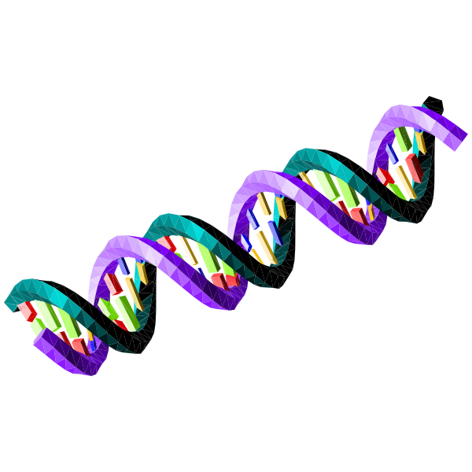

<!-- PROJECT LOGO -->
 

  

  <h3 align="center">Best-README-Template</h3>

  

    See how your sequences align! [Check it online](https://gero1999.shinyapps.io/Pair-Aligner/)
  

<!-- ABOUT THE PROJECT -->
## About The Project

What are the uses of this app? 
* Compare the homology of two sequences graphically 
* Obtain an score to assess an alignment
* Use dynamic programming (Watermann algorithm) to deduce the optimal solution

Of course, no one template will serve all projects since your needs may be different. So I'll be adding more in the near future. You may also suggest changes by forking this repo and creating a pull request or opening an issue. Thanks to all the people have contributed to expanding this template!

Use the `BLANK_README.md` to get started.

(<a href="#top">back to top</a>)

<!-- GETTING STARTED -->
## Getting Started

This is an example of how you may give instructions on setting up your project locally.
To get a local copy up and running follow these simple example steps.

