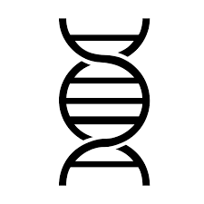

<!-- PROJECT LOGO -->
 

  

  <h3 align="center">Clone-Trigger</h3>
  
  <a href="https://share.streamlit.io/gero1999/code/main/streamlit/prot-profiler-app/app.py"><strong>Check the app »</strong></a>

  

    Decide your primers easiliy
     
    <a href="https://github.com/Gero1999/code/edit/main/Python/HMM_profile_analyser"><strong>Explore the docs »</strong></a>
     
     
  

<!-- ABOUT THE PROJECT -->
## About The Project

The app suggests a 20-tip list of forward and reverse primers to use in a cloning process given as input the whole sequence, and the targeted insert inside it. Other variables to consider are the opening reading frame of interest, the length of the primers and an insert integrity factor that will alter the evaluation of which primers are the best by considering more primordial those with less mismatches in the insert than outside of it. 

The utility of this project remains in:
* Fazilitating the determination of the optimal primers in a cloning experiment
* Simplify the comparison between different restriction enzymes
* Consider different opening reading frames

### Built With

This section should list any major frameworks/libraries used to bootstrap your project. Leave any add-ons/plugins for the acknowledgements section. Here are a few examples.

* [Pandas]()
* [Numpy]()
* [Streamlit]()

(<a href="#top">back to top</a>)

<!-- USAGE EXAMPLES -->
## Usage

Let's imagine you have this particular sequence:

<code>
  AAAAAAAAAAAAAAAAAAAAAAAAAAAAAAAAAAAAGAGTCGAAGGAGTCGAAGGAGTCGAAAAAAAAAAAAAAAAAAAAAAAAAAAAAAAAAAAA

And you are interested in extracting the next insert:
  
  
                                      GAGTCGAAGGAGTCGAAGGAGTCGA
</code>

In order to do so, you will probably need to design forward and reverse primers that by mutagenesesis generate the particular restriction sites that you need. These primers will have a particular desired lenght (12-30 bp), the forward primer will start in conconrdance with the openning reading frame of interest. However some other considerations are taking into account:

1) The selected lenght of the primer. The algorithm will find for each enzyme's restriction site in the database what is a potential primer whose central pb are the restriction site. In case the desired lenght of the primer is odd, it will be prolonged in one base from the extreme that adds a G or a C preferably. Reverse primers might be related to the complementary strand, so the complemntary bases are produced. 
2) The opnening reading frame. Determines the different potential starts of the forward primers. All possibilities are generated.
3) The restriction site's flexilibity. Some enzymes present more than one potential restriction site. For those cases, the most concordant site will be selected. In case there is not, G and C bases are prefered. 

After that, for each enzyme we will obtain a punctuation in each ORS (Open Reading Start). The evaluation process is based on the number of mismatches outside the insert and the number of mismatches inside it. The weight of this last variable can be modulated by the user with the insert integrity factor. The top-20 results (lowest mismatch score) are displayed.

<!-- ADDITIONALLY -->
## Information & Contact

(<a href="#top">back to top</a>)

