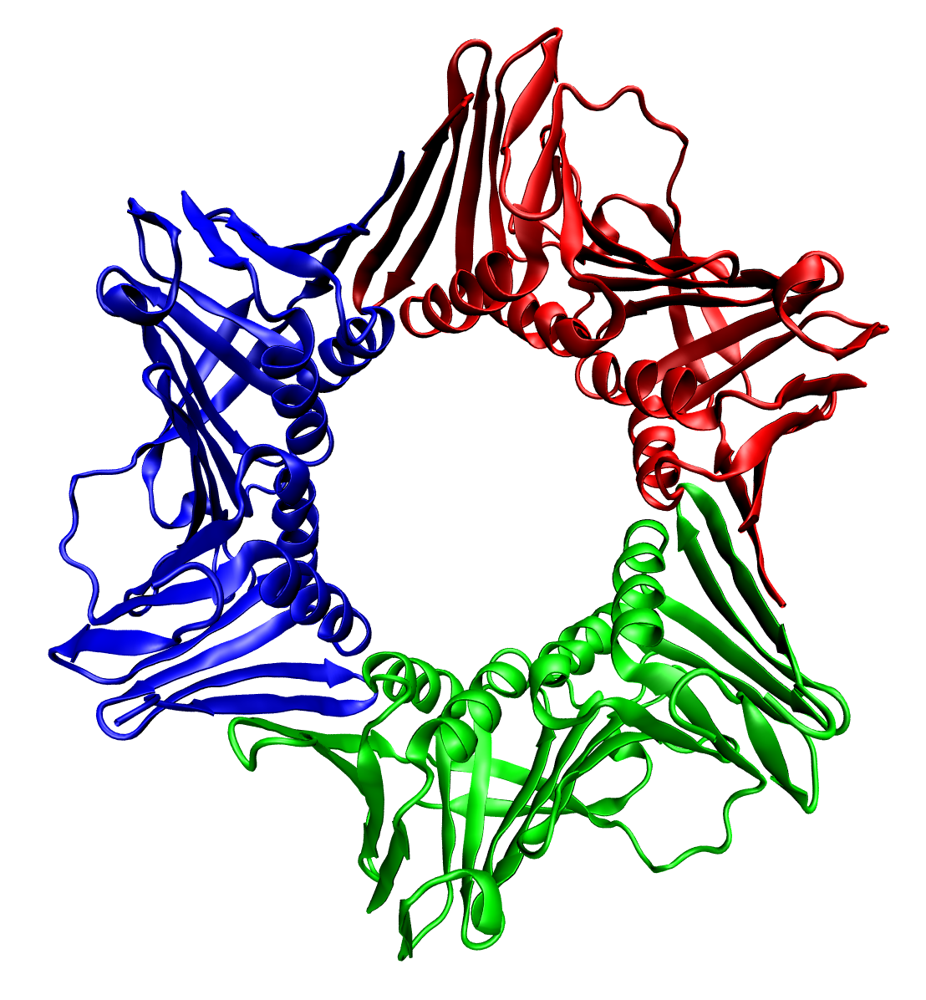

<!-- PROJECT LOGO -->
 

  

  <h3 align="center">HMM-profiler</h3>
  
  <a href="https://share.streamlit.io/gero1999/code/main/streamlit/prot-profiler-app/app.py"><strong>Check the app »</strong></a>

  

    Read your proteins secrets
     
    <a href="https://github.com/Gero1999/code/edit/main/Python/HMM_profile_analyser"><strong>Explore the docs »</strong></a>
     
     
  

<!-- ABOUT THE PROJECT -->
## About The Project

The utility of this project remains in:
* Capturing the biological features and characteristics behind a protein family
* Using basic code to build simple HMM models
* Evaluate new potential proteins belonging to the identified family

The files you can find in this repository are:
1) Given a set of sequences (presumably from the same protein family) it constructs a HMM model of two matrices, one revealing state transitions (being the states: Deletion, Insertion, Match) or emissions (for the 20 aminoacids).
2) HMM_decoder_and_evaluator. Given a HMM profile involving two matrices (state transition and residue emission) the function can generate the most probable sequence, or alternatively given one sequence calculate its probability to be part of the considered family.

### Built With

This section should list any major frameworks/libraries used to bootstrap your project. Leave any add-ons/plugins for the acknowledgements section. Here are a few examples.

* [Pandas]()
* [Numpy]()
* [Collections]()

(<a href="#top">back to top</a>)

<!-- USAGE EXAMPLES -->
## Usage

Let's imagine you have 3 (or more) sequences of proteins that are partially related, mayben even from the same family. In the given example, they belong to the TAF family (which is characterized for very small proteins). Make sure to separate them by a new line (\n) like this:

<code>
  FVEIPRESVRLMAESTGLELSDEVAALLAEDVCYRLREATQNSSQFMKHTKRRKLTVEDFNRALRMSIVPKETIEVIGQSVGIANLPADVSAALAPDVEYRLREIMQEAIKCMRHAKRTVLTADDVDSALSLR
                         MSIVPKETVEVIAQSIGITNLLPEAALMLAPDVEYRVREIMQEAIKCMRHSKRTTLTASDVDGALNLRLTVWNIESIKDVAEMLGIGNLADEPAAAIAMDLEYRIHQVVQEAKFMVHSKRTVLTSADISSALR

TIWSPQDTVKDVAESLGLENINDDVLKALAMDVEYRILEIIEQAVKFKRHSKRDVLTTDDVSKALR
</code>

Then the first thing the algorithm will do is perform a Multiple Sequence Alignment (sequential alignment based on pairs score) in order to determine a common way to compare the residues of each protein/fragment by their position. The dots represent the gaps in the alignment:

<code>
F·VEI·PRES···VRLMA·E····STGL···E·····L·SDEV···A·ALLAE·DVC·YR··LREA··T···Q·NSSQ·F···MKHTKRRK··LT···VEDFNRA··LR

MSI·V·PKETIE·V··IG·Q····SVGI·AN······LPAD·V·SAA···LAP·DV·EYR··LRE····I·MQ····EAIKC·MRHAK·R·TVLTADDV·D·S·ALSLR

MSI··VPKETV·EV··IA·QS····IGIT·NLL·····P·E···AAL··MLAP·DV·EYR··VRE···IMQ···EAI·KC·MR·HSK·R·TTLT·ASDV·D·G·ALNLR
  LTVWNI··ESIKDV···AE·M·LG···I·GN·LADEP··A··A··AIAM···DL·EYRIH·Q··VVQ···E·A·TK·FM·V··HSK·R·T·VLTSA·DI·S·S·A··LR·TIWS·PQDTVKDV···AE··SLGLENI··N···DD······VLKALAM···DV·EYRI·LE··II····EQA·VK·F···KRHSK·R··DVLTT·DDV···SKA··LR
</code>

Once this results are obtained, the algorithm will determine which columns/positions are match-states (M) or insertion states (I) based on a simple rule: Insetion states are those who present more than 50% gaps, thus it is rare to encounter "additional" residues. 

Afterwards, all insertion states are considered the same in terms of emissions, they all are expected to randomly add aminoacids (this is obviously a mathematical simplification).

On the other hand, for each match state the algorithm calculates its emission rates based on the frequency of appearance of each aminoacid. If the user doesn't count with many sequences, it is recommended to include a pseudocount value (PC>0) to elude impossible cases in terms of emission.

Finally, based on the sequency of letters and gaps by each sequence, a transition matrix is calculated for the different states. Transitions can occur to a match state (letter in a match column), deletion state (gap in a match column) or insertion state (letter in a insertion column).

With all this information, we have developed a HMM-profile. Now you can use your information in order to generate new potential proteins that were considered from the same family, or test potential members still unknown. 

<!-- ADDITIONALLY -->
## Information & Contact

The protein represented in the entrance of the document is the human PCNA (1AXC), you can read more about it or obtain the image in [Wikipedia](https://da.wikipedia.org/wiki/Fil:1axc_tricolor.png)

(<a href="#top">back to top</a>)

