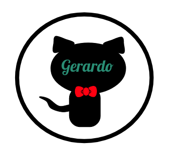

<!-- PROJECT LOGO -->
 

  <a href="https://github.com/othneildrew/Best-README-Template">
    

  <h3 align="center">Portfolio website</h3>
  
  <a href="https://share.streamlit.io/gero1999/code/main/streamlit/resume/resume.py"><strong>Check the app »</strong></a>

  

    Read your proteins secrets
     
     
  

<!-- ABOUT THE PROJECT -->
## About The Project

You can see my credentials, projects and more in these portfolio website. By using stremalit and Pyhton programming you can also create your own online resume!

